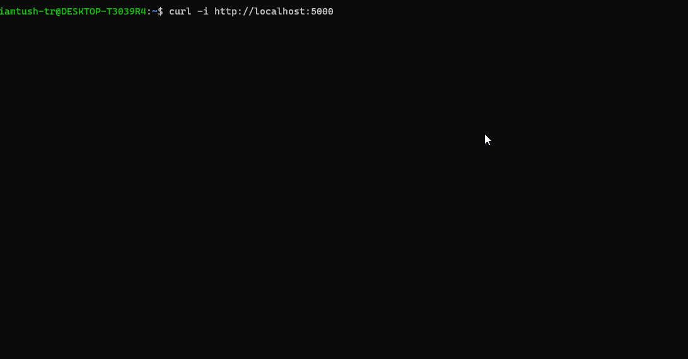

# Flask Sample Restful API
A Restfull API developed using flask.
## What is REST?
The characteristics of a REST system are defined by six design rules:
<ul>
<li>Client-Server: There should be a separation between the server that offers a service, and the client that consumes it.</li><li>
Stateless: Each request from a client must contain all the information required by the server to carry out the request. In other words, the server cannot store information provided by the client in one request and use it in another request.</li><li>
Cacheable: The server must indicate to the client if requests can be cached or not.</li><li>
Layered System: Communication between a client and a server should be standardized in such a way that allows intermediaries to respond to requests instead of the end server, without the client having to do anything different.</li><li>
Uniform Interface: The method of communication between a client and a server must be uniform.</li><li>
Code on demand: Servers can provide executable code or scripts for clients to execute in their context. This constraint is the only one that is optional.
</li>
</ul>

## Implementing RESTful services in Python and Flask

### Libraries used--
```Python
from flask import Flask, jsonify
from flask import abort
from flask import make_response
from flask import request
```
### Securing a RESTful web service
```Python
from flask_httpauth import HTTPBasicAuth
```
## How to use--
Clone the repo
<pre>$ git clone https://github.com/tush-tr/flask-sample-restful-api</pre>
<pre>$ cd flask-sample-restful-api</pre>
<pre>$ pip3 install flask</pre>
<pre>$ pip3 install flask_httpauth</pre>
<pre>$ python3 main.py</pre>

### Authentication
```Bash
$ curl -u tushar:mycode -i http://localhost:5000
```

### Getting data from the API
```Bash
$ curl -u tushar:mycode -i http://localhost:5000
```
### For getting data of a specific id
```Bash
$ curl -u tushar:mycode -i http://localhost:5000/id-number
```
### For adding new data
```Bash
curl -i -H "Content-Type: application/json" -X POST -d '{"name":"Jabb","breed":"labra","age":3}' http://localhost:5000
```
### For updating existing data
```Bash
curl -i -H "Content-Type: application/json" -X PUT -d '{"name":"Jack","breed":"pug","age":3}' http://localhost:5000/2
```


<h1 align="center">Preview</h1>

